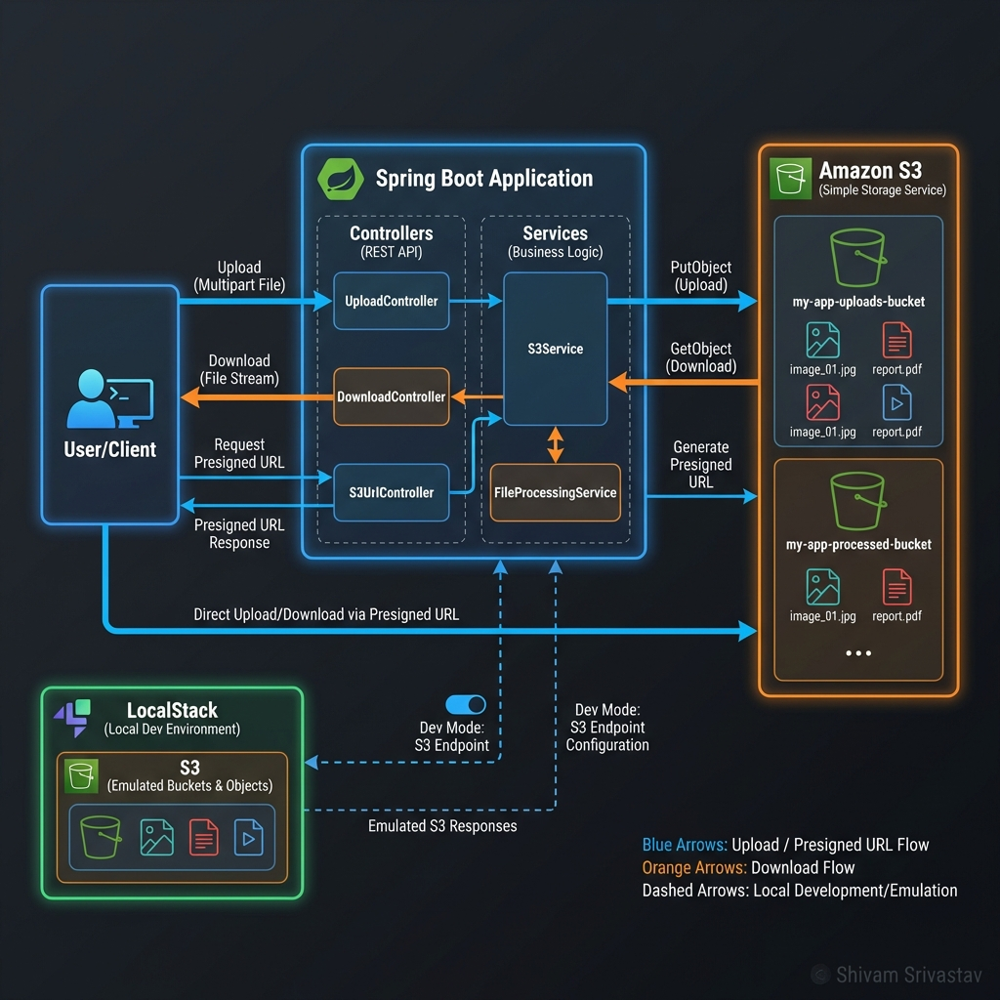
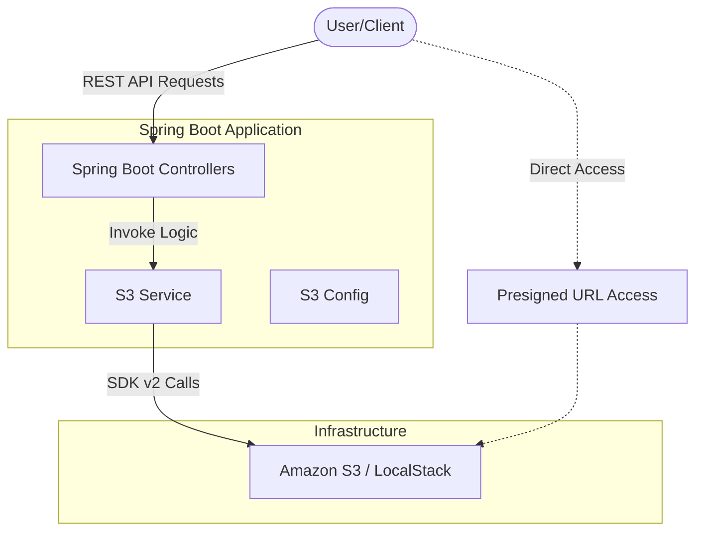

# AWS S3 Interview Mastery with Spring Boot



This project is a comprehensive guide and hands-on laboratory for mastering **Amazon S3** using **Spring Boot** and **AWS SDK v2**.

## 🏗 System Architecture



## 🚀 Key S3 Concepts for Interviews

### 1. Storage Classes
*   **Standard:** High durability, availability, and performance for frequently accessed data.
*   **Intelligent-Tiering:** Automatically moves data between tiers based on access patterns.
*   **Standard-IA (Infrequent Access):** Lower cost for long-lived, less active data.
*   **One Zone-IA:** Lower cost for non-critical, reproducible data (stored in 1 AZ).
*   **Glacier Instant Retrieval:** Millisecond retrieval for data accessed once or twice a year.
*   **Glacier Flexible Retrieval:** Retrieval times from minutes to hours.
*   **Glacier Deep Archive:** Lowest cost, retrieval with 12-48 hours latency.

### 2. Consistency Model
*   **Strong Consistency:** Since December 2020, S3 provides strong read-after-write consistency for all operations (PUTs, DELETEs) across all regions. This includes both new objects and overwrites.

### 3. S3 Versioning
*   Protects against accidental deletes or overwrites.
*   When you delete an object in a versioned bucket, S3 inserts a **Delete Marker**. To permanently delete, you must specify the version ID.

### 4. S3 Lifecycle Policies
*   Used to automate transitioning objects between storage classes (e.g., Standard -> Glacier after 30 days) or expiring (deleting) them.

### 5. IAM vs. Bucket Policies vs. ACLs
*   **IAM Policies:** Assigned to Users/Roles (Who can do what?).
*   **Bucket Policies:** Resource-based (Who can access this specific bucket?).
*   **ACLs:** Legacy way to manage access at the object level (mostly superseded by Bucket Policies).

### 6. S3 Performance Optimization
*   **Multi-part Uploads:** Recommended for files > 100MB, mandatory for files > 5GB.
*   **S3 Transfer Acceleration:** Uses CloudFront Edge Locations for faster uploads over long distances.
*   **Key Naming:** Use prefixes to distribute load across S3 partitions (legacy concern mostly, but still good to know).

### 7. Security Features
*   **Encryption at Rest:** SSE-S3 (S3 managed keys), SSE-KMS (AWS KMS keys), SSE-C (Customer provided keys).
*   **Encryption in Transit:** Enforced via HTTPS (TLS).
*   **Object Lock:** WORM (Write Once Read Many) - prevents deletion for a retention period.
*   **Block Public Access:** A bucket-level setting to prevent any public exposure.

---

## 🛠 Features Implemented in this Project

1.  **Bucket Operations:** Create, List, Delete.
2.  **Object CRUD:** Multipart upload, Download, Delete, Metadata.
3.  **Advanced Java SDK v2 usage:**
    *   **Presigned URLs:** Generate temporary access for GET and PUT.
    *   **Lifecycle Configuration:** Automate transitions.
    *   **Versioning:** Enable programmatic version control.
    *   **Multipart Uploads:** Manual implementation for high performance.
    *   **Transfer Manager:** High-level API for optimized transfers.

## 🧪 Testing with LocalStack

To run this locally without an AWS account:

```bash
# Start LocalStack
docker run --rm -p 4566:4566 -p 4510-4559:4510-4559 localstack/localstack
```

Update `application.properties`:
```properties
aws.s3.endpoint=http://localhost:4566
aws.s3.access-key=test
aws.s3.secret-key=test
aws.s3.region=us-east-1
```

## 📝 Common Interview Questions

1.  **How do you handle large file uploads in S3?**
    *   *Ans:* Use Multipart Upload API. It allows uploading parts in parallel, improves reliability (retry only failed parts), and can pause/resume.
2.  **What is a Presigned URL?**
    *   *Ans:* A URL generated by the owner of an object using their credentials to grant temporary access (limited time) to someone else without making the object public.
3.  **Difference between SSE-S3 and SSE-KMS?**
    *   *Ans:* SSE-S3 uses keys managed by S3. SSE-KMS uses AWS Key Management Service, providing an audit trail of key usage and more control.
4.  **How to prevent accidental deletion of objects?**
    *   *Ans:* Enable Versioning and Multi-Factor Authentication (MFA) Delete. Use Object Lock for compliance.
5.  **Is S3 eventually consistent?**
    *   *Ans:* It USED to be eventually consistent for overwrites and deletes, but since 2020, it is **Strongly Consistent** for all operations.
